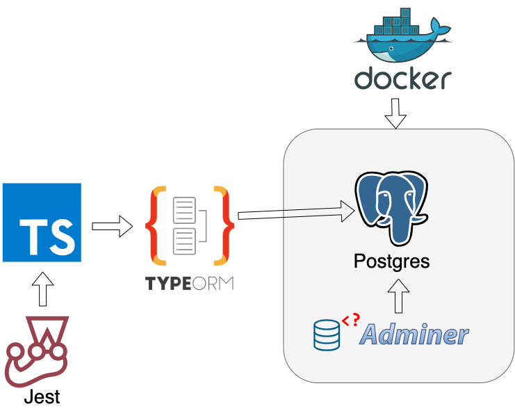

# Server node.js in typescript 
the server has CI when failed in build the image. some notes of CI in files.txt and configurations, too jest for tests unitaries and dockerhub in the file Dockerfile. In the folder docker is the database called postgres.yml, remenber instaled docker in your pc for executed postgres.yml and Node js 17.1.0

# CI
directory .github/worflows
# docker
database: directory serverTest/docker

# dockerhub
build docker image Dockerfile
directory serverTest/docker

# Figura de herramientas del proyecto

